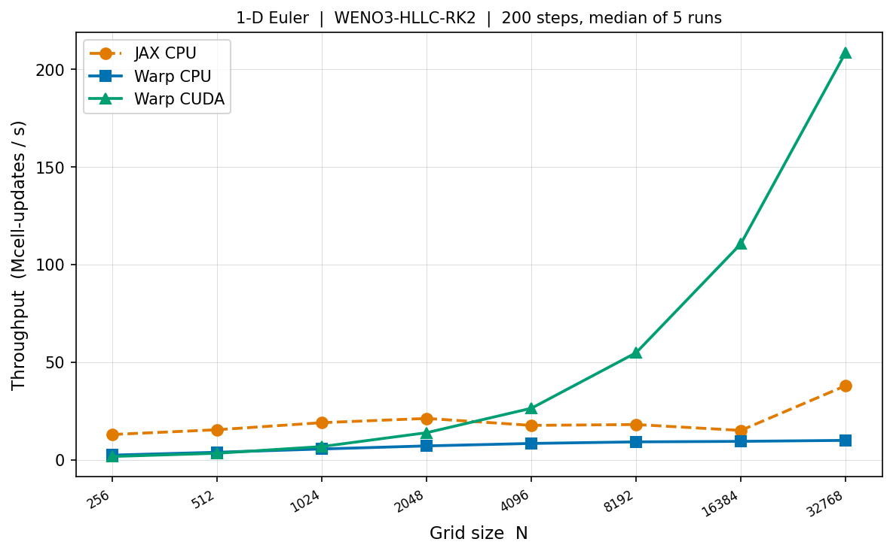

# warplabs-fluids

Experimental GPU-accelerated compressible flow solver built on [NVIDIA Warp](https://github.com/NVIDIA/warp).
Validated against a JAX reference implementation with identical numerics.

**Phase 1 complete.** 1-D compressible Euler, WENO3-HLLC-RK2, float32.

---

## Solver

| Component | Choice |
|---|---|
| Equations | Compressible Euler (inviscid) |
| Reconstruction | WENO3 on primitive variables (Jiang & Shu 1996) |
| Riemann solver | HLLC (Toro 2009) |
| Time integration | SSP-RK2 |
| Ghost cells | ng = 2 |
| Default CFL | 0.4 |
| Precision | float32 |

## Kernel architecture

Kernel boundaries sit at global-memory write points.
`@wp.func` functions (WENO3, HLLC) run entirely in registers inside `compute_flux_1d`.

```
bc_kernel          1 launch   fill ghost cells
compute_flux_1d    1 launch   WENO3 + HLLC fused  (Q_L/Q_R stay in registers)
update_rk_1d       1 launch   RK stage update
─────────────────────────────────────────────
3 launches x 2 RK stages = 6 launches per timestep
```

---

## Install

```powershell
pip install warp-lang numpy scipy matplotlib jax
```

---

## Quick start

```python
import numpy as np
from warplabs_fluids import WarpEuler1D, prim_to_cons

N, gamma = 512, 1.4
dx = 1.0 / N
x  = (np.arange(N) + 0.5) * dx

rho = np.where(x < 0.5, 1.0, 0.125)
u   = np.zeros(N)
p   = np.where(x < 0.5, 1.0, 0.1)
Q0  = prim_to_cons(rho, u, p, gamma)

solver = WarpEuler1D(N, dx, gamma=gamma, bc="outflow")
solver.initialize(Q0)
solver.run(t_end=0.2, cfl=0.4)

rho_out = solver.state[0]
```

---

## Tests

```powershell
# From examples/warplabs_fluids/
python -m pytest tests/ -v
```

15 tests covering: primitives roundtrip, WENO3 order/bias, HLLC rest/supersonic/Sod,
Sod L1 vs exact Riemann (N=256,512), mass+momentum conservation (periodic BC).
All tests run on Warp CPU — no CUDA required.

---

## Benchmarks

```powershell
python benchmarks/compare_sod.py       # accuracy + single-N throughput
python benchmarks/scaling_benchmark.py # throughput vs N, finds GPU crossover
```

**Results on RTX 5000 Ada / Intel Core Ultra 9:**

| N | JAX CPU | Warp CPU | Warp CUDA |
|---|---|---|---|
| 512 | 15.4 | 3.9 | 3.4 |
| 4096 | 17.7 | 8.4 | **26.4** |
| 32768 | 38.0 | 10.0 | **208.6** |

Throughput in Mcell-updates/s. Warp CUDA crossover vs JAX CPU at N~4096; 5.5x ahead at N=32768.



---

## Roadmap

| Phase | Status | Scope |
|---|---|---|
| 1 | **complete** | 1-D Euler, WENO3-HLLC, Sod V&V, N-scaling benchmark |
| 2 | next | 2-D Euler, Strang splitting, Kelvin-Helmholtz V&V |
| 3 | planned | 2-D Navier-Stokes (viscous + heat), Taylor-Green |
